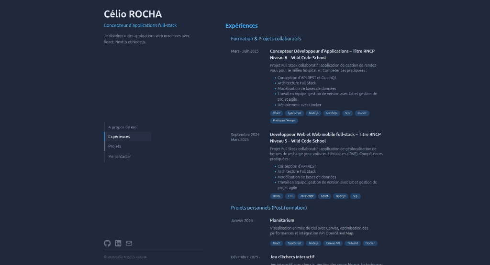

# Portfolio – Développeur Web

Bienvenue sur mon portfolio personnel.
Ce projet présente mes réalisations, mes compétences et permet de me contacter directement via un formulaire.

---


## Démo

 [https://celio-mozes.fr](https://celio-mozes.fr)

---

## Fonctionnalités

* Présentation de mes projets
* Section Expériences/compétences
* Formulaire de contact avec envoi d’email
* Validation des champs avec Zod
* Expérience utilisateur optimisée :

  * bouton désactivé si formulaire invalide
  * loader pendant l’envoi
  * feedback utilisateur (succès / erreur)

---

## Stack technique

* **Frontend** : Next.js, React, TypeScript
* **UI** : Tailwind CSS, Framer Motion
* **Formulaire** : React Hook Form + Zod
* **Backend** : API route Next.js
* **Email** : SMTP (Brevo)
* **CI/CD** : GitHub Actions + Docker
* **Déploiement** : VPS (Docker Compose)

---

## Installation

```bash
git clone https://github.com/celio-mozes-rocha/portfolio.git
cd ton-repo
npm install
npm run dev
```

---

## Variables d’environnement

Créer un fichier `.env` :

```env
SMTP_HOST=your_smtp_host
SMTP_PORT=your_smtp_port
SMTP_USER=your_user
SMTP_PASS=your_password
CONTACT_EMAIL=your_email
```

---

## Déploiement

Le projet est automatiquement déployé via **GitHub Actions** :

* build de l’image Docker
* transfert vers le VPS
* lancement avec Docker Compose
* gestion des variables via secrets GitHub

---

## Structure du projet

```
├── app
│   ├── api
│   │   └── contact
│   │       └── route.ts
├── components
│   ├── sections
│   │   ├── contact
│   │   │   ├── ContactForm.tsx
│   │   │   └── Contact.tsx
│   │   ├── experiences
│   │   │   ├── ExperienceCard.tsx
│   │   │   └── Experience.tsx
│   │   ├── Projects.tsx
│   └── SideBar.tsx
├── lib
│   ├── contact-schema.ts
│   ├── rateLimit.ts
│   └── utils.ts
```

---

## Améliorations futures

* Ajout de notifications toast
* Amélioration des animations
* Optimisation SEO
* Optimisation du responsive

---

## Me contacter

Via le formulaire du site
ou directement : **[celio.rocha@free.fr](mailto:celio.rocha@free.fr)**

---

## Licence

Ce projet est open-source.

